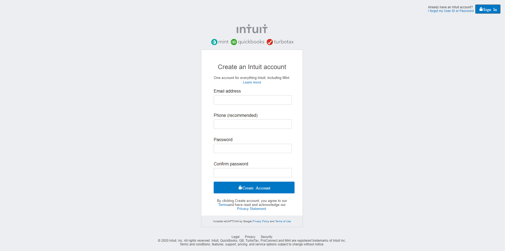

# Mint.com sing up page project

> This is the second collaborative project from Microverse program, It's a mock-up of a Mint's page, it's built on HTML and CSS3 languages.

## Built With

- HTML and CSS3

## Live Demo

[Live Demo Link](https://rawcdn.githack.com/diazgio/Mint-singup-project/3e7a02196e562c020af1d0e8d6d8ce9b841c1a09/index.html)

## Getting Started

To get a local copy up and running follow these simple example steps.

- Go to the main page of te repo.
- Press the "Code" button and get the repo link.
- Clone it using git.

## Authors

👤 **Miguel Uzcátegui**

- Github: [@miguelus373](https://github.com/miguelus373)

👤 **Giordano Díaz**

- Github: [@diazgio](https://github.com/diazgio)
- Twitter: [@giordano_diaz](https://twitter.com/giordano_diaz)

## 🤝 Contributing

Contributions, issues and feature requests are welcome!

Feel free to check the [issues page](issues/).

## 📝 License

This project is [MIT](lic.url) licensed.
